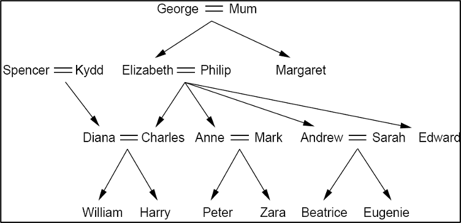

#Prolog Family Tree
Use Prolog to create a knowledge base for the family tree of Figure 1 and then ask queries about the family tree. Assume the intended interpretation of all predicates of the form p(x,y) is that “x is the p of y”.
Enter the information from this family tree as a set of Prolog facts using only the three predicates wife, son and daughter. Note, the females are: Mum, Kydd, Elizabeth, Margaret, Diana, Anne, Sarah, Zara, Beatrice, and Eugenie.



## To Run
```
gprolog
[family_tree].
findall(S, sisterInLaw(S, diana), Result).
husband(H, sarah).
```
